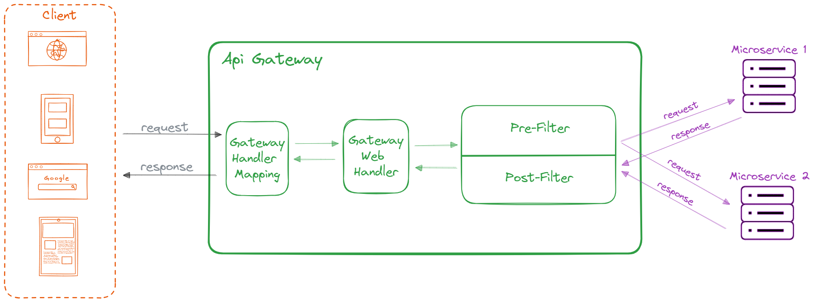

# Spring Gateway + OAuth2

## API Gateway

### Concept
Utilizing the Microservices Pattern may necessitate a client to fetch data from various microservices. Directly invoking each service from client could result in extended load times,
as the client would be required to initiate a network request for each service call. Additionally, relying on the client to directly communicate with each service establishes a tight
coupling between the client and the service. This connection becomes problematic if the internal implementations of the microservice undergo changes, such as their combination in the
future, or if the location (host and port) of a microservice is changed. In such cases, every client using those microservices would need to be updated accordingly.

An API Gateway serves as a singular entry point for a set of microservices. In simple word, all microservices can be reached through a unified port or route. Functioning as a non-blocking
and reactive gateway, it offers various features such as routing, filtering, load-balancing, circuiting-breaking, and more.

### Architecture
